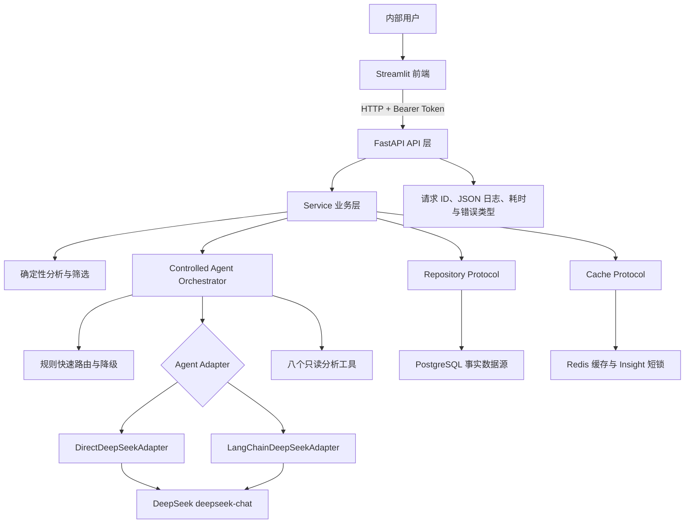

# App 评论分析 Agent 最终升级计划

> 文档版本：1.0
> 基线日期：2026-08-06
> 适用仓库：[app-review-analysis-agent](https://github.com/bluesblue320-hue/app-review-analysis-agent)
> 目标读者：项目开发者、后续执行计划的 Codex、面试官
> 建议周期：11 周，按阶段验收，不并行跳过可靠性门禁

## 一、项目最终目标

将当前 App 评论分析原型升级为一个可演示、可测试、可持久化、可降级的 AI 应用：

- 使用 Streamlit 提供前端交互。
- 使用 FastAPI 提供统一后端 API。
- 使用 Pydantic 校验 HTTP 请求、工具参数和 Agent 输出。
- 保留原生 DeepSeek Tool Calling，并增加 LangChain DeepSeek Adapter。
- 使用八个确定性、只读的 Python 分析工具，不让模型承担业务计算。
- 使用 PostgreSQL 持久化数据集、评论和 AI 洞察。
- 使用 Redis 缓存确定性分析结果，并为 AI 洞察生成提供短时锁。
- 使用固定评估集验证路由、工具选择、参数提取、回答约束和故障降级。
- DeepSeek、LangChain 或 Redis 故障时，确定性分析和规则 Agent 仍然可用。
- 通过 GitHub Actions、Docker Compose、结构化日志和隐私防护形成完整工程交付。

最终技术栈：

```text
Python
Streamlit
FastAPI
Pydantic
Pandas
DeepSeek
LangChain
Tool Calling
PostgreSQL
SQLAlchemy 2
Alembic
Redis
pytest
Ruff
Docker Compose
GitHub Actions
```

本周期明确不实现：

```text
Next.js 前端
Celery 或其他任务队列
LangGraph 工作流
RAG
向量数据库
多 Agent 协作
复杂用户体系或用户级数据隔离
多实例部署
超过 10,000 条评论的单数据集
```

停止扩张原则：完成本文“项目完成标准”后进入演示、投递和维护阶段。除非出现明确业务需求，不继续增加框架或基础设施。

---

## 二、当前真实基线

### 2.1 Git 与历史基线

- 当前分支：`main`。
- 当前 `main` 已合并 PR #1（受控 Tool Calling）和 PR #2（固定 Agent 评估）。
- PR #2 合并后的历史 Agent 基线为 `41/46`，失败集中在不可回答问题和无证据绝对结论。
- 当前工作树包含大量未提交改动，必须保留并整理，禁止执行破坏性重置。

历史评估记录应保存为：

```text
evaluation/baselines/baseline-main-20260805/
├── summary.json
├── cases.jsonl
└── report.md
```

### 2.2 当前候选结果

当前未提交 Guardrail 改动的独立 Mock Agent 评估结果为：

```text
总案例：46
通过：46
失败：0
所有聚合指标：1.0
```

该结果只能标记为 `candidate-guardrails`，不能视为已交付，因为完整 pytest 当前无法收集完成。

### 2.3 当前集成阻塞

截至基线日期，已确认：

- `backend/schemas/analytics.py` 的分页响应与评分/情绪不一致响应类定义存在缩进错误。
- `backend/services/analytics_service.py` 的缓存写入和返回位置存在缩进错误。
- SQLAlchemy Insight Store 接口和过期清理需要补齐并通过统一 Repository 契约测试。
- 安全中间件、请求 ID、生命周期清理文件已存在，但尚未接入 FastAPI 主应用。
- SQLAlchemy、Alembic、Redis、Ruff、pytest-cov 尚未进入正式依赖配置。
- 根目录存在多个临时 `.patch` 文件，核对改动已落盘后必须移除。
- pytest 当前收集到 119 个测试后因 API Schema 导入错误中止；不能将其与历史“145 个测试和 3 个子测试通过”混为同一状态。

### 2.4 已部分实现的能力

以下内容应先审查和补测，不应从头重写：

- 复杂问题关键词和多意图路由。
- 不可回答问题 Guardrail。
- `limitations` 响应字段。
- 模型结构化输出解析和数字来源校验。
- 服务端内存 Insight Store，前端仅提交 `insight_id`。
- 完整筛选范围的评分/情绪不一致总数。
- 数据集删除、评论分页、SQLAlchemy 和 Redis 基础文件。
- Bearer、安全中间件、请求 ID 和过期清理基础文件。

以下内容仍明确缺失：

- 评分必须在 1～5 范围内的严格过滤和无效行统计。
- 正式的 `evidence_call_ids` API 字段。
- Direct/LangChain Adapter 抽象和 LangChain 实现。
- PostgreSQL 生产实现的完整依赖、迁移和回归测试。
- Redis Insight 短锁、缓存版本和可靠失效策略。
- CI、Compose、PII 脱敏、完整日志接线和 Streamlit 最终体验。

---

## 三、最终系统架构



核心边界：

1. PostgreSQL 是数据集、评论和洞察的唯一事实来源。
2. Redis 可以随时丢失，不存完整评论，不保存任何业务数据的唯一副本。
3. LangChain 只负责模型消息、工具绑定和结构化输出，不负责指标计算。
4. 所有工具由确定性 Python 函数实现，并通过现有 `ToolExecutor` 执行。
5. 模型不能注册新工具、执行任意代码、生成 SQL 或修改数据。
6. Agent 编排层统一执行工具上限、证据校验、结论校验和规则降级。
7. Streamlit 不导入业务分析函数，只通过 FastAPI 获取结果。

---

## 四、锁定的技术决策

### 4.1 LangChain 接入方式

- 使用 `langchain-deepseek` 的 `ChatDeepSeek`。
- 模型固定为 `deepseek-chat`，不使用不支持工具调用和结构化输出的 reasoning 模型。
- 使用 `bind_tools` 和自行维护的有界消息循环，不使用 LangChain `create_agent`。
- 单次请求最多成功或尝试执行 3 个工具，达到上限后进入合成或降级。
- LangChain Adapter 与 Direct Adapter 使用同一工具白名单、参数 Schema、ToolExecutor、Guardrail 和结果类型。
- 固定 LangChain 及集成包版本；升级版本时同时运行 Direct/LangChain 契约测试和固定评估。

### 4.2 Agent Adapter 接口

Adapter 只负责模型交互，不包含业务分析：

```python
class AgentModelAdapter(Protocol):
    def plan_tools(self, request: AgentPlanRequest) -> AgentPlan:
        ...

    def synthesize(self, request: SynthesisRequest) -> AgentAnswer:
        ...
```

实现：

```text
DirectDeepSeekAdapter
LangChainDeepSeekAdapter
```

共享 Orchestrator 负责：

```text
可回答性判断
规则快速路由
最多三次工具调用
工具白名单
Pydantic 参数校验
工具证据收集
PII 脱敏
结构化回答校验
数字和绝对结论校验
规则降级
Tool Trace
```

### 4.3 不可回答问题行为

不可回答判断必须在 LLM 规划之前执行：

- 纯预测、因果、用户流失或收入估计问题没有描述性子问题时，不调用无关工具，直接返回限制，`evidence_call_ids=[]`。
- 问题同时包含可回答的描述部分时，只执行支持该描述部分的相关只读工具；回答现状并拒绝预测或因果结论。
- 不编造预测数字，不把评论相关性写成技术根因或商业因果。

示例：

```json
{
  "answer": "当前评论数据无法确定修复账号问题后会减少多少用户流失。当前样本只能说明账号问题在负面反馈中较突出。",
  "limitations": [
    "缺少用户级活跃、留存和流失定义。",
    "缺少修复前后对照或实验数据。"
  ],
  "evidence_call_ids": ["call_1"]
}
```

### 4.4 分页契约

保留现有：

```text
view + offset + limit
```

- `view`：`all`、`high_risk`、`rating_sentiment_mismatch`。
- `offset >= 0`。
- `1 <= limit <= 100`。
- 默认排序由 view 决定，不在本周期增加任意字段排序。

### 4.5 数据上传和事务

- 单次最大 10 MB、10,000 行、50 列、单条评论 5,000 字符。
- 支持 UTF-8、UTF-8 BOM 和 GB18030。
- 评分使用 `pd.to_numeric(errors="coerce")` 后严格保留 `between(1, 5)` 的行；禁止使用 `clip`。
- 同步上传使用单一数据库事务；dataset 和 reviews 全部成功后一起提交。
- 失败时完全回滚，不持久化 `processing` 或 `failed` 半成品数据集。

### 4.6 数据生命周期

- 默认保留 30 天，创建时写入 `expires_at`。
- 过期数据在读取时立即视为不存在。
- 应用启动执行一次清理，此后每小时清理一次。
- 额外提供可手工执行的管理命令，用于补跑清理；不依赖任务队列。
- 删除和过期均使相关 reviews、insights 和缓存不可访问。

---

## 五、公共接口与类型契约

### 5.1 API 清单

| 方法 | 路径 | 鉴权 | 说明 |
| --- | --- | --- | --- |
| `GET` | `/api/v1/health` | 否 | 进程存活，不检查依赖 |
| `GET` | `/api/v1/ready` | 否 | 检查数据库和迁移；Redis 可降级 |
| `POST` | `/api/v1/datasets` | 是 | 上传、校验、预处理和持久化 CSV |
| `DELETE` | `/api/v1/datasets/{dataset_id}` | 是 | 删除数据集及全部关联记录 |
| `POST` | `/api/v1/analytics/summary` | 是 | 对完整服务端范围重新筛选并生成摘要 |
| `POST` | `/api/v1/analytics/reviews/search` | 是 | 独立评论分页查询 |
| `GET` | `/api/v1/ai/config` | 是 | 返回 AI 是否可用，不返回 Key |
| `POST` | `/api/v1/ai/insights` | 是 | 生成、保存洞察并返回 `insight_id` |
| `POST` | `/api/v1/agent/query` | 是 | 规则或受控 Tool Calling Agent |

除 `/health` 和 `/ready` 外，所有接口要求：

```http
Authorization: Bearer <APP_ACCESS_TOKEN>
```

`APP_ENV=production` 且未配置 `APP_ACCESS_TOKEN` 时，服务拒绝启动。

### 5.2 上传响应

```json
{
  "dataset_id": "dataset_xxx",
  "original_rows": 1000,
  "valid_rows": 960,
  "removed_rows": 40,
  "invalid_rating_rows": 18,
  "invalid_reasons": {
    "invalid_rating": 18,
    "empty_content": 22
  },
  "columns": ["评分", "内容", "时间", "版本"],
  "created_at": "2026-08-06T08:00:00Z",
  "expires_at": "2026-09-05T08:00:00Z"
}
```

### 5.3 AgentAnswer

```python
class AgentAnswer(BaseModel):
    answer: str
    limitations: list[str] = Field(default_factory=list)
    evidence_call_ids: list[str] = Field(default_factory=list)
```

校验：

- `answer` 必填且非空。
- `limitations` 和 `evidence_call_ids` 必须是字符串数组。
- evidence ID 只能引用本次请求中状态为 `success` 的工具调用。
- 规则路径使用 Orchestrator 生成的稳定调用 ID，例如 `rule_1`。
- 不存在的 ID 会使模型结果校验失败并进入规则降级，不能静默保留伪造 ID。
- 回答中的业务数字必须能在被引用的工具结果中找到。
- “最好、最差、一定、必然、唯一、根因、证明、导致”等结论必须有明确评价维度和相应证据，否则改写为有限结论或降级。

### 5.4 Agent API 响应

保持现有 `routing` 枚举兼容：

```text
rule
tool_calling
rule_fallback
```

```json
{
  "intent": "negative_review_analysis",
  "answer": "基于当前筛选范围……",
  "limitations": [],
  "evidence_call_ids": ["call_1", "call_2"],
  "scope": "filtered",
  "scope_label": "当前筛选数据",
  "sample_size": 320,
  "scope_signature": "sha256...",
  "tables": {},
  "routing": "tool_calling",
  "tool_calls": [],
  "evidence": {},
  "warnings": []
}
```

### 5.5 评论分页

请求：

```json
{
  "dataset_id": "dataset_xxx",
  "filters": {},
  "view": "high_risk",
  "offset": 0,
  "limit": 50
}
```

响应：

```json
{
  "items": [],
  "total": 132,
  "offset": 0,
  "limit": 50,
  "next_offset": 50
}
```

总数基于完整筛选结果；摘要中的预览数量不参与总数统计。

### 5.6 统一错误

```json
{
  "error": {
    "code": "dataset_not_found",
    "message": "指定的数据集不存在或已过期。"
  },
  "request_id": "request_xxx"
}
```

- 所有响应返回 `X-Request-ID`。
- 客户端提供合法 request ID 时复用，否则服务端生成。
- 重复删除统一返回 `dataset_not_found`。
- 错误响应不包含栈、SQL、密钥、评论正文或 provider 原始响应。

---

## 六、确定性工具契约

LangChain 和 Direct Adapter 共享以下八个工具：

```text
get_review_metrics
analyze_negative_reviews
analyze_positive_reviews
find_high_risk_reviews
compare_versions
analyze_sentiment_trend
calculate_issue_priority
retrieve_representative_reviews
```

要求：

- 工具名称静态注册，不允许模型动态创建。
- 参数复用现有 Pydantic Schema，`extra="forbid"`。
- 工具只读，不接收 SQL、文件路径、表达式或数据库 Session。
- LangChain Tool 只是 `ToolExecutor` 的适配层，不复制分析算法。
- 返回 JSON 可序列化结构，不把 DataFrame 直接交给模型。
- 每次执行返回 `call_id`、名称、状态、参数、耗时和稳定错误类型。

---

## 七、数据模型与签名契约

### 7.1 datasets

```text
dataset_id             varchar(100) PK
filename               varchar(255)
original_rows          integer
valid_rows             integer
removed_rows           integer
invalid_rating_rows    integer
invalid_reasons_json   jsonb
columns_json           jsonb
content_hash           varchar(64)
analysis_version       varchar(32)
created_at             timestamptz
expires_at             timestamptz index
```

### 7.2 reviews

```text
id                     bigint PK
dataset_id             varchar(100) FK ON DELETE CASCADE
row_number             integer
rating                 double precision
content                text
title                  text nullable
review_time            timestamptz nullable
version                varchar(100) nullable
sentiment              double precision nullable
tokens                 text nullable
primary_category       varchar(100) nullable
categories_json        jsonb
risk_label             varchar(100) nullable
extra_json             jsonb
created_at             timestamptz
```

约束：

- `(dataset_id, row_number)` 唯一。
- 常用索引首先覆盖 dataset、row number、rating、sentiment、risk label 和 category；最终保留项由查询计划验证。
- 固定分析字段独立列存储，其余上传字段进入 `extra_json`。

### 7.3 insights

```text
insight_id             varchar(100) PK
dataset_id             varchar(100) FK ON DELETE CASCADE
scope_signature        varchar(64)
sample_size            integer
content_json           jsonb
provider               varchar(50)
model_name             varchar(100)
analysis_version       varchar(32)
insight_fingerprint    varchar(64)
created_at             timestamptz
expires_at             timestamptz index
```

约束：

```text
UNIQUE(insight_fingerprint)
```

fingerprint 使用固定字段顺序计算：

```text
payload = json.dumps(
    [
        dataset_id,
        scope_signature,
        str(int(sample_size)),
        analysis_version,
        provider,
        model_name
    ],
    ensure_ascii=False,
    separators=(",", ":")
).encode("utf-8")
insight_fingerprint = sha256(payload).hexdigest()
```

序列化规则：

- 使用上述固定顺序的 JSON 数组，不使用无分隔符的字符串直接拼接。
- 使用 UTF-8、`ensure_ascii=false` 和固定紧凑分隔符。
- `sample_size` 先转为十进制整数字符串。
- fingerprint 不包含生成时间、过期时间或 Redis 锁 token。

生成与复用行为：

1. 请求模型前，先查询相同 fingerprint 且未过期的 Insight；存在时直接复用。
2. 相同 fingerprint 的记录已过期时，允许重新调用模型，但更新原记录的 `content_json`、`provider`、`model_name`、`created_at` 和 `expires_at`，不创建第二条记录。
3. 记录不存在时，模型生成后使用 insert-or-get-existing 写入；并发插入触发唯一约束冲突时，读取并返回已存在记录，不能返回 500。
4. PostgreSQL 唯一约束只保证最终不产生重复 Insight 记录；Redis 不可用时，多个并发请求仍可能产生重复外部模型调用和费用。

复用洞察时必须同时满足 fingerprint 一致且记录未过期；fingerprint 已覆盖：

```text
dataset_id
scope_signature
sample_size
analysis_version
provider
model_name
```

### 7.4 Repository

Service 只依赖 Protocol：

```text
DatasetRepository
InsightRepository
```

实现：

```text
InMemoryRepository：单元测试
SqlAlchemyRepository：PostgreSQL 生产、SQLite 本地集成测试
```

Router 不创建 SQLAlchemy Session；事务由 Repository 或 Unit of Work 控制。

InsightRepository 必须提供按 fingerprint 查询、插入或读取已存在记录、刷新过期记录的能力。数据库写入流程锁定为：

```text
查询未过期 fingerprint → 命中则复用
未命中但存在过期记录 → 模型生成后按 fingerprint 更新原记录
完全不存在 → INSERT ... ON CONFLICT DO NOTHING → SELECT 已存在记录
```

唯一约束冲突属于正常并发结果，Repository 必须在当前事务或保存点正确回滚冲突语句后重新查询，不能把 IntegrityError 传播为 HTTP 500。

### 7.5 范围签名

上传完成时计算规范化数据内容哈希：

```text
dataset.content_hash
```

查询范围签名：

```text
scope_signature = sha256(
    dataset.content_hash
    + canonical_filters
    + analysis_version
)
```

筛选规范化：

- 类别去重并排序。
- 空列表、空字符串和 null 使用固定表示。
- 关键词去除首尾空格。
- 浮点数使用固定格式。
- JSON 字段按 key 排序并使用稳定分隔符。

`scope_signature` 不包含 `insight_id`。引用洞察的摘要缓存 Key 单独包含 `insight_id`。

---

## 八、Redis 契约

Redis 只实现：

```text
确定性分析缓存
AI 洞察生成短时锁
```

### 8.1 Cache 抽象

```python
class Cache(Protocol):
    def get(self, key: str) -> dict | None: ...
    def set(self, key: str, value: dict, ttl_seconds: int) -> None: ...
    def delete(self, key: str) -> None: ...
```

实现：

```text
NullCache
MemoryCache
RedisCache
```

Service 不直接依赖 redis-py。

### 8.2 Key

```text
ara:{env}:v1:analytics:{dataset_id}:{scope_signature}:{analysis_type}:{insight_id_or_none}
ara:{env}:v1:lock:insight:{dataset_id}:{scope_signature}
ara:{env}:v1:dataset-keys:{dataset_id}
```

- `v1` 是缓存 Schema 版本。
- `scope_signature` 已包含分析算法版本。
- 默认分析 TTL 为 600 秒。
- 不使用 Redis `KEYS` 扫描生产 keyspace。

### 8.3 读取顺序

```text
先从 PostgreSQL 验证 dataset 存在且未过期
→ 计算 scope_signature 和 cache key
→ 查询 Redis
→ 未命中或 Redis 失败则实时计算
→ 最佳努力写入缓存
```

即使 Redis 残留旧值，被删除或过期的数据集也不能通过缓存返回。

### 8.4 删除和失效

- 写缓存时，将 cache key 加入数据集 key 索引集合并设置不短于缓存的 TTL。
- 删除数据集时先提交 PostgreSQL 事务，再对索引集合中的 key 执行最佳努力删除。
- 缓存失效失败只记录安全日志；由于读取前验证数据库，旧缓存不可见，并会由 TTL 清理。
- analysis version 改变后 scope signature 改变，不读取旧结果。

### 8.5 Insight 短锁

- 使用 `SET key token NX EX <ttl>`。
- token 为随机值。
- 释放锁使用比较 token 的原子 Lua 操作，不能删除其他请求获得的新锁。
- 锁 TTL 覆盖模型总超时并留有小幅余量。
- 获取锁前先按 `insight_fingerprint` 查询 PostgreSQL；已有相同 fingerprint、未过期洞察时直接复用。
- 获得 Redis 锁后再次查询 PostgreSQL，避免等待期间已有其他请求完成写入。
- 模型生成完成后通过 InsightRepository 执行 insert-or-get-existing 或过期记录更新。
- Redis 短锁是减少重复模型调用的优化层，不是唯一幂等保障。
- Redis 失败时允许继续生成，并在 UI 提示实时模式；并发请求此时可能重复调用外部模型。
- 无论 Redis 是否可用，PostgreSQL 的 `UNIQUE(insight_fingerprint)` 都必须保证最终只有一条对应 Insight 记录。
- 不得声称数据库唯一约束能够完全避免重复模型费用；当前单实例、低并发边界接受 Redis 故障时的额外调用成本。

洞察生成流程：

```text
计算 fingerprint
→ 查询 PostgreSQL 未过期记录
→ 尝试 Redis 短锁
→ 获锁后再次查询 PostgreSQL
→ 必要时调用模型
→ PostgreSQL insert-or-get-existing 或更新过期记录
→ 安全释放 Redis 锁
```

---

## 九、安全、隐私与可观测性

### 9.1 PII 脱敏

所有发送给外部模型的评论、标题和工具证据统一替换：

```text
手机号      → [PHONE]
邮箱        → [EMAIL]
身份证样式  → [CN_ID]
银行卡样式  → [BANK_CARD]
```

- 脱敏在构造模型消息前完成，不能依靠提示词让模型脱敏。
- Streamlit 当前会话首次调用外部模型前必须展示传输说明并取得确认。
- 未确认时仍可使用看板和规则 Agent。
- 数据库是否保留授权原文由项目数据政策决定；日志始终不能保存敏感原文。

### 9.2 JSON 日志

允许字段：

```text
timestamp
level
service
environment
request_id
route
status_code
duration_ms
dataset_id_hash
adapter
routing
tool_names
cache_hit
error_code
```

禁止字段：

```text
Authorization
Cookie
API Key
数据库密码
完整评论正文
完整用户问题
完整 Prompt
完整模型输入输出
provider 原始错误正文
```

### 9.3 健康检查

- `/health` 只验证进程存活。
- `/ready` 检查 PostgreSQL 连接和 Alembic revision。
- Redis 作为可选缓存，故障时 `/ready` 可返回 `degraded`，不能让 API 整体不可用。
- DeepSeek 不属于 readiness 依赖。

---

## 十、配置契约

| 配置 | 默认 | 生产要求 |
| --- | --- | --- |
| `APP_ENV` | `development` | `production` |
| `APP_ACCESS_TOKEN` | 空 | 必填 |
| `DATABASE_URL` | 本地 SQLite | PostgreSQL URL |
| `STORAGE_BACKEND` | `memory` | `database` |
| `REDIS_URL` | 空 | 使用缓存时配置 |
| `AGENT_ADAPTER` | `direct` | 灰度后可设 `langchain` |
| `DEEPSEEK_API_KEY` | 空 | 外部模型可选 |
| `DEEPSEEK_MODEL` | `deepseek-chat` | 固定为支持工具调用的模型 |
| `LLM_TIMEOUT_SECONDS` | `60` | 正整数 |
| `LLM_MAX_TOOL_CALLS` | `3` | 服务端最大仍为 3 |
| `DATA_RETENTION_DAYS` | `30` | 正整数 |
| `MAX_UPLOAD_SIZE_MB` | `10` | 不高于批准值 |
| `MAX_DATASET_ROWS` | `10000` | 不高于批准值 |
| `MAX_DATASET_COLUMNS` | `50` | 不高于批准值 |
| `MAX_REVIEW_TEXT_CHARS` | `5000` | 不高于批准值 |
| `ANALYTICS_CACHE_TTL_SECONDS` | `600` | 正整数 |
| `ANALYSIS_VERSION` | `v1` | 算法变化时递增 |
| `ENABLE_DOCS` | `true` | 生产默认 `false` |

所有配置在启动时校验类型、范围和组合条件；错误必须尽早失败。


---

## 十一、分阶段实施

### 阶段 0：修复当前工作树

建议时间：2～3 个工作日。

**目标**

恢复可导入、可收集、可测试的代码基线，并将已部分实现功能与未来阶段基础文件整理清楚。

**依赖**

- 无。
- 当前工作树必须完整保留。

**任务**

在修复任何语法、导入或集成问题前，必须先完成可恢复的 Git 安全快照：

1. 记录 `git status --short`、完整 tracked diff、diff stat 和全部 untracked 文件清单。
2. 从当前提交创建专用 rescue 分支，不在原分支直接整理工作树。
3. 将当前 tracked 与 untracked 内容全部加入一个 WIP 保护提交。
4. 验证保护提交能够完整还原修复前工作树，再开始任何代码修复。
5. 禁止使用 `git reset --hard`、`git clean -fd`、`git checkout -- .` 或其他会丢弃当前改动的命令。

```bash
git status --short
git diff --binary > worktree-before-stage0.patch
git diff --stat > worktree-before-stage0.stat
git ls-files --others --exclude-standard > worktree-untracked-files.txt

git switch -c rescue/upgrade-worktree-20260806
git add -A
git commit -m "wip: preserve current upgrade worktree"
```

`git diff --stat` 只是审阅摘要，不能作为恢复备份；普通 `git diff` 也不包含 untracked 文件。若因仓库状态或权限无法创建 WIP 提交，必须同时保存可应用的完整 binary patch、逐项复制 untracked 文件到仓库外安全目录，并在副本或临时 worktree 完成一次恢复校验。WIP 提交在最终 PR 中可以 squash，但在确认正式提交已完整包含其内容前不得删除 rescue 分支或备份。

完成安全快照后再执行以下修复：

6. 修复 Analytics Schema 和 Analytics Service 缩进错误。
7. 修复 SQLAlchemy Insight Store 方法签名和 `cleanup_expired` 契约。
8. 检查中间件、生命周期和安全文件是否可导入；未完成接线使用明确开关隔离。
9. 核对根目录临时 `.patch` 内容已落入目标文件；脚手架不得进入正式提交。
10. 将工作树按 Agent、API、持久化、缓存和安全划分为可审查改动组。
11. 确保开发环境可运行 pytest-cov，并记录全项目覆盖率基线；阶段 0 不设置覆盖率失败阈值。
12. 运行完整收集、pytest 和 Mock Agent 评估，登记仍存在的稳定功能失败。

**测试**

```bash
python -m compileall -q backend frontend evaluation tests
python -m pytest --collect-only -q
python -m pytest -v --cov=. --cov-report=term-missing --cov-report=xml
python -m evaluation.evaluate_agent --mode mock --fail-under
git diff --check
```

**验收**

**必须通过的硬门禁**

- rescue 分支、WIP 提交或等价的完整 patch 加 untracked 文件备份已经存在，并已验证可以还原修复前工作树。
- `compileall` 通过。
- `pytest --collect-only` 通过且完整收集预期测试；不能通过跳过目录、缩小测试发现范围或临时删除测试达成。
- 不存在语法、导入、缩进、Pydantic Schema 构建或循环依赖错误。
- Mock Agent 固定评估保持 `46/46`。
- 临时 `.patch` 中的有效内容已进入目标源文件，补丁脚手架不进入正式提交。
- 已记录全项目覆盖率基线，但阶段 0 不以覆盖率数值阻断退出。

**允许遗留到阶段 1 的事项**

- 仅允许稳定、可复现且已经登记负责人、失败测试、原因与阶段 1 修复任务的功能断言失败。
- 不允许把收集失败、导入失败、依赖缺失、环境初始化失败或偶发失败登记为“允许遗留”。
- 遗留失败不得破坏 Mock Agent `46/46`，也不得让硬门禁中的命令失败。

**回退**

- 从 rescue 分支的 WIP 保护提交或已验证的 patch 加 untracked 备份恢复，不重置或覆盖用户原有工作树。
- 只回退本阶段新引入的集成修复；未成熟的数据库或安全实现通过配置保持关闭，但保留代码和测试供后续完成。
- 在正式提交已确认完整前，不清理 WIP、rescue 分支或外部备份。

**建议 PR**

```text
PR 3
fix: stabilize current upgrade worktree and restore test collection
```

WIP 保护提交用于恢复，不要求原样进入 PR；确认正式提交完整后可 squash。

---

### 阶段 1：Agent 可靠性、数据质量、CI 与安全基础

建议时间：第 1～2 周。

**目标**

完成评分校验、AgentAnswer、不可回答与绝对结论防护，并在继续接入框架前建立 CI、鉴权、请求 ID 和 PII 基础。

**依赖**

- 阶段 0 的硬门禁全部通过，并且所有遗留功能失败已登记为阶段 1 的明确任务。

**任务**

1. 严格过滤不在 1～5 范围内或无法解析的评分，记录删除原因。
2. 复核复杂问题先于简单意图的路由顺序，补足多目标和否定表达测试。
3. 将 `evidence_call_ids` 加入统一 AgentAnswer 和 API 响应。
4. 按“纯不可回答”和“包含可回答子问题”执行锁定行为。
5. 完善数字、评价维度、绝对结论和提示注入校验。
6. 验收服务端 Insight Store：跨数据集、范围变化、样本数变化和过期均不可复用。
7. 验收完整范围的高星低情绪总数和独立预览列表。
8. 引入 `pyproject.toml`、Ruff、pytest-cov，并分离运行依赖与开发依赖。
9. 建立基础 GitHub Actions：lint、完整 pytest、渐进覆盖率、Mock Agent、应用导入。
10. 确保全项目覆盖率不低于阶段 0 基线；可靠性、安全和 API 的新增或修改代码目标覆盖率不低于 80%。
11. 接入 Bearer 鉴权、request ID、敏感日志过滤和 PII 脱敏单元测试；真实 LangChain 调用前必须完成。

**测试**

- 评分 0、6、10、`abc`、空值被删除；1～5 保留。
- 单指标不调用模型；复杂问题进入 Tool Calling。
- 4 个不可回答案例和 `adversarial_004` 通过。
- 无证据数字、伪造 evidence ID、绝对结论触发降级。
- 前端只提交 `insight_id`。
- 鉴权缺失和错误令牌返回 401。
- 日志捕获测试不包含 token、评论原文或 PII。

**验收**

```text
完整 pytest 通过
全项目覆盖率不低于阶段 0 已记录基线
阶段 1 全项目覆盖率目标 >= 70%；达到后将 70% 设为本阶段及后续阶段的最低门禁
可靠性、安全和 API 的新增或修改代码覆盖率目标 >= 80%
Mock Agent 46/46
回答约束通过率 100%
不可回答识别率 100%
非法工具拦截率 100%
```

新增或修改核心代码未达到 80% 时，PR 必须记录未覆盖分支、风险和补测任务，不得以降低全项目门禁掩盖缺口。

**回退**

- Guardrail 误伤时增加确定性测试并细化规则，不能关闭数字或结论校验。
- 安全中间件若影响开发，可在 `APP_ENV=development` 使用测试 token，但生产缺 token 必须拒绝启动。

**建议 PR**

```text
PR 4
fix: complete agent reliability data validation and security baseline
```

---

### 阶段 2：Direct 与 LangChain 双 Adapter

建议时间：第 3～4 周。

**目标**

在不删除现有 DeepSeek Tool Calling 的前提下，建立共享 Orchestrator 和两个可切换 Adapter。

**依赖**

- 阶段 1 的 AgentAnswer、Guardrail、PII、鉴权和 CI 已稳定。

**任务**

1. 提取 `AgentModelAdapter`、`AgentPlanRequest`、`AgentPlan` 和 `SynthesisRequest`。
2. 将现有 DeepSeek Client 包装为 `DirectDeepSeekAdapter`，不改变现有行为。
3. 使用 `ChatDeepSeek.bind_tools` 实现 `LangChainDeepSeekAdapter`。
4. 以现有 ToolExecutor 包装八个 LangChain Tool，复用参数 Schema。
5. 实现最多三次的手工有界循环，不调用 `create_agent`。
6. LangChain 结构化输出解析后，再经过统一服务端证据、数字和结论校验。
7. 增加 `AGENT_ADAPTER=direct|langchain` 配置，默认 direct。
8. 扩展评估 CLI 的 `--adapter direct|langchain`。
9. Mock 报告用于确定性回归门禁，必须继续对两个 Adapter 执行固定 `46/46`；不得用 Live 结果替代。
10. 完成 Direct/LangChain 首次 Live 对比评估，作为阶段 2 的人工验收交付物，不加入普通 PR CI。

**测试**

两个 Adapter 使用同一契约测试，覆盖：

```text
单工具
多工具
超过三次工具
非法工具
非法参数
工具失败
API Key 缺失
模型超时
模型非法 JSON
模型不调用工具
结构化输出失败
虚假数字
无证据绝对结论
```

Live 对比使用冻结的 15～20 个代表性案例，至少覆盖：

```text
单工具与多工具
带版本参数的问题
带评论数量参数的问题
纯不可回答与含可回答子问题的问题
提示注入和其他对抗输入
模型调用失败与规则降级
缺少评价维度的“最好、一定、直接推广”等绝对结论
```

冻结案例后不得为迎合某个 Adapter 的结果调整数据集或期望。Direct 与 LangChain 各独立运行 3 次，按以下目录保存经过脱敏的运行元数据和汇总：

```text
evaluation/reports/live-comparison/
├── direct-run-1/
├── direct-run-2/
├── direct-run-3/
├── langchain-run-1/
├── langchain-run-2/
├── langchain-run-3/
└── comparison.md
```

`comparison.md` 至少比较：

- 工具选择正确率与参数正确率。
- 回答约束通过率与不可回答识别率。
- 平均工具调用数和降级率。
- 平均延迟与 P95 延迟。
- 模型调用次数；供应商可提供时记录 token 用量。
- 同一 Adapter 三次运行的一致性。
- 按工具选择、参数、Schema、Guardrail、超时、供应商和降级分类的失败明细。

Live 报告必须如实保留失败、波动和外部服务限制，不得只挑选成功运行。仓库不提交未经脱敏的完整 Prompt、评论正文、原始模型响应、token 或其他敏感内容；原始证据应保存在受控环境，报告只保存复现所需的非敏感元数据、摘要和哈希。简历和 README 只能引用实际完成的运行及可核验指标。

**验收**

- Direct 与 LangChain Mock 均为 46/46。
- 切换 Adapter 不改变 HTTP Schema。
- LangChain 不绕过 ToolExecutor 和 Guardrail。
- 缺少 Key 或 LangChain 故障时返回 `rule_fallback`。
- 回调和日志不记录完整模型输入输出。
- 全项目覆盖率达到 75% 以上。
- Adapter、Orchestrator 和 LangChain Tool Adapter 的新增或修改代码覆盖率达到 80% 以上。
- 首次 Live 对比的 6 次运行目录和 `comparison.md` 完整；该人工交付物不是普通 PR CI 门禁。

**回退**

- 将 `AGENT_ADAPTER` 切回 `direct`。
- 外部模型整体故障时禁用模型，继续规则 Agent。

**建议 PR**

```text
PR 5
feat: add bounded LangChain DeepSeek adapter with shared tools
```

---

### 阶段 3：Repository、PostgreSQL 与 Alembic

建议时间：第 5～6 周。

**目标**

替换进程内业务状态，实现重启恢复、事务回滚、级联删除、范围签名和 30 天生命周期。

**依赖**

- 阶段 1 的 API 和数据质量契约稳定。
- 阶段 2 的 Insight/Agent 使用方式稳定。

**任务**

1. 定义 DatasetRepository 和 InsightRepository Protocol。
2. 保留内存实现供单元测试使用。
3. 按本文 Schema 完成 SQLAlchemy 2 PostgreSQL 实现。
4. 创建 Alembic 初始迁移、外键、唯一约束和必要索引。
5. 上传使用单事务批量插入；任何失败全部回滚。
6. 在 InsightRepository 实现按 `insight_fingerprint` 查询、原子 insert-or-get-existing 和过期同记录刷新。
7. 将 Insight Store 切换为 PostgreSQL Repository；唯一约束冲突必须读取并返回已有记录，不返回 500。
8. 实现级联删除、启动清理、每小时清理和管理命令。
9. 使用 `content_hash + canonical_filters + analysis_version` 生成范围签名，并保持其与 Redis cache key 职责分离。
10. 增加 `/ready` 数据库与迁移检查。
11. Service 的类型标注和构造不再依赖具体内存类。

**测试**

- 空 PostgreSQL 执行 `alembic upgrade head`。
- 在临时数据库验证一次 downgrade/upgrade；生产不自动 downgrade。
- 服务重启后 dataset 和 insight 可恢复。
- 模拟批量插入失败后没有 dataset 或部分 reviews。
- 删除级联清除 reviews 和 insights。
- 到期前可读、到期时不可读、重复清理幂等。
- 并发读取不会串数据。
- 相同筛选签名稳定，筛选或 analysis version 变化时签名变化。
- 相同 fingerprint 的并发洞察请求最终只保存一条 Insight 记录。
- 唯一约束冲突执行 insert-or-get-existing，返回已有记录且不产生 500。
- 已过期的相同 fingerprint 刷新原记录，保持相同 Insight ID，不新增第二行。

**验收**

- PostgreSQL 是生产唯一事实来源。
- 10,000 条评论可在一个受控事务中保存。
- 数据删除或过期后所有 API 返回 `dataset_not_found`。
- 生产启动不调用 `Base.metadata.create_all`。
- 数据库唯一约束保证每个 `insight_fingerprint` 最终仅有一条 Insight 记录。
- 全项目覆盖率不低于阶段 2 的 75% 门禁；Repository、PostgreSQL 实现和迁移相关新增或修改代码覆盖率达到 80% 以上。

**回退**

- 开发测试可以切回内存 Repository。
- 生产迁移失败时阻止 API 启动，回滚应用镜像并恢复备份；不自动执行破坏性迁移回退。

**建议 PR**

```text
PR 6
feat: persist datasets reviews and insights with PostgreSQL
```

---

### 阶段 4：Redis 分析缓存与 Insight 短锁

建议时间：第 7 周。

**目标**

减少重复确定性计算和重复模型调用，同时证明 Redis 故障不影响核心功能。

**依赖**

- 阶段 3 的 PostgreSQL、范围签名和删除流程稳定。

**任务**

1. 完成 Cache Protocol、NullCache、MemoryCache 和 RedisCache。
2. 按本文 Key 规范缓存摘要、版本、趋势、关键词和优先级。
3. 读取缓存前验证 PostgreSQL 数据集存在性。
4. 缓存值包含 schema version，且可严格 JSON 序列化。
5. 实现数据集 key 索引和最佳努力失效，不使用 `KEYS`。
6. 实现 Insight 原子短锁、token 安全释放和自动 TTL；锁只用于减少重复模型调用，不承担数据唯一性。
7. 获取锁前按 `insight_fingerprint` 查询 PostgreSQL，获得锁后再次查询；命中未过期记录则不调用模型。
8. Redis get/set/delete/lock 异常全部降级，由 PostgreSQL 唯一约束和 insert-or-get-existing 继续保证不产生重复 Insight 行。
9. 记录 cache hit、cache error、锁竞争、模型调用次数和实时计算耗时。

**测试**

- 冷缓存、热缓存、TTL 到期和 schema version 变化。
- 不同 dataset、filters、analysis type 和 insight ID 不串缓存。
- 删除后残留缓存不能返回数据。
- Redis 断开、超时、读失败和写失败不返回 500。
- Redis 正常时，并发相同 fingerprint 请求通过短锁尽量只产生一次模型调用，并最终只有一条 Insight 记录。
- Redis 关闭时允许发生重复模型调用和额外费用，但 PostgreSQL 最终只有一条 Insight 记录。
- 数据库唯一约束冲突返回已有记录，不产生 500。
- 已过期的相同 fingerprint 更新原记录，不新增第二行。
- 锁持有者异常后可由 TTL 恢复。

**验收**

- 热缓存结果与实时计算完全一致。
- Redis 关闭后上传、分析和 Agent 正常。
- 删除和过期不会返回旧缓存。
- Redis 不包含完整评论或业务唯一数据。
- 无论 Redis 是否可用，相同 fingerprint 最终只有一条数据库记录。
- Redis 短锁是成本优化，不承诺故障时完全消除重复模型调用；内部低并发 MVP 接受这一额外成本。
- 全项目覆盖率不低于阶段 3；Redis、Cache Protocol、失效和短锁相关新增或修改代码覆盖率达到 80% 以上。

**回退**

- 清空 `REDIS_URL` 或启用 NullCache。
- Redis 中所有数据可直接丢弃并重建。

**建议 PR**

```text
PR 7
feat: add Redis analytics cache and insight generation lock
```

---

### 阶段 5：工程化、部署、故障与性能验收

建议时间：第 8～9 周。

**目标**

完成可重复构建、结构化日志、隐私接线、容器部署、性能基线和故障演练。

**依赖**

- 阶段 1 CI 基础已存在。
- 阶段 2～4 的 Adapter、PostgreSQL 和 Redis 已稳定。

**任务**

1. 完善 GitHub Actions：Ruff、覆盖率、双 Adapter Mock、PostgreSQL/Redis 集成、迁移和 Compose 冒烟。
2. 提供 API、Streamlit Dockerfile 和 `api/postgres/redis/streamlit` Compose。
3. 只暴露 Streamlit；FastAPI、PostgreSQL 和 Redis 使用内部网络。
4. FastAPI 固定单 worker。
5. 接入结构化 JSON 日志、请求 ID、耗时、错误类型、Adapter、routing 和 cache hit。
6. 审计所有 DeepSeek 路径，确保统一 PII 脱敏和会话确认。
7. 生成固定随机种子的 10,000 行中文合成夹具。
8. 建立上传、摘要、分页和 Redis 性能脚本。
9. 完成 DeepSeek、LangChain、Redis、PostgreSQL 和删除/过期故障演练。
10. 完成 PostgreSQL 备份和隔离环境恢复演练。

**性能目标**

| 场景 | 目标 |
| --- | --- |
| 10,000 行上传、预处理和持久化 | 当前开发机不超过 30 秒 |
| 预热摘要 | P95 不超过 3 秒 |
| 评论分页，limit=100 | P95 不超过 1 秒 |
| 规则 Agent | P95 不超过 3 秒 |

外部模型响应时间单独统计，必须受总超时控制，不纳入确定性 SLA。

**测试**

```text
DeepSeek 超时、429、5xx、非法 JSON
LangChain 结构化输出失败
Redis 断开和慢响应
PostgreSQL 不可用
非法工具和参数
旧 insight_id
数据集过期和删除
服务重启恢复
备份恢复
```

**验收**

- CI 所有必需检查通过，全项目覆盖率达到 80% 以上；从阶段 5 起将 80% 作为不可降低的最终硬门禁。
- Compose 新环境按 README 一次启动成功。
- 日志不包含 token、PII、评论正文或完整 Prompt。
- 可降级故障不导致服务崩溃；数据库故障返回明确 `not_ready` 或服务错误。
- 性能指标有可重复报告。

**回退**

- Adapter 切回 direct。
- Redis 切为 NullCache。
- 外部模型关闭后继续规则模式。
- 应用镜像回滚必须与当前数据库 revision 兼容。

**建议 PR**

```text
PR 8
chore: add CI Compose observability privacy and performance gates
```

---

### 阶段 6：Streamlit 体验优化

建议时间：第 10 周。

**目标**

只优化展示和工作流，不更换前端框架，不复制后端业务逻辑。

**依赖**

- 阶段 3～5 的 API、分页、删除和安全契约稳定。

**任务**

1. 将登录、会话、上传、看板、评论、AI 洞察和 Agent 展示从单体 `app.py` 拆分为组件。
2. 访问令牌只保存在当前 Streamlit Session，不进入共享缓存。
3. 筛选器改为 `st.form`，仅提交时请求摘要。
4. 使用 `view + offset + limit` 分页加载评论。
5. 展示上传有效/无效行、过期时间和主动删除入口。
6. 删除、过期或 401 后统一清理 dataset、summary、insight 和分页状态。
7. 首次外部模型调用前要求当前会话确认。
8. 展示回答、limitations、scope、tool calls、evidence IDs、warnings 和降级模式。

**测试**

- 登录成功、失败和会话失效。
- UTF-8、BOM、GB18030 上传。
- 控件变化不请求，点击提交只请求一次。
- 分页前后翻页，筛选变化 offset 归零。
- 主动删除、过期和重新上传。
- AI 未配置、模型失败和规则降级。
- 令牌不进入全局 Client、日志或 URL。

**验收**

- Streamlit 可以完成完整五分钟演示流程。
- 指标和总数全部来自后端。
- 评论分页不依赖摘要前 100 条预览。
- AI 故障不会阻塞确定性看板。

**回退**

- 保留现有 Streamlit 页面装配入口；组件化出现回归时可按页面逐项回退，不影响后端数据库。

**建议 PR**

```text
PR 9
feat: improve Streamlit evidence pagination and dataset workflows
```

---

### 阶段 7：README、演示与求职交付

建议时间：第 11 周。

**目标**

把已经验证的技术能力整理为可复现的作品集材料，不宣称未测量的性能或可靠性结果。

**依赖**

- 阶段 0～6 全部完成。

**任务**

1. README 记录项目背景、架构、八个工具、双 Adapter、评估、数据库、Redis、降级和限制。
2. 增加本地、Docker、测试、迁移和评估命令。
3. 保存 Direct/LangChain Mock `46/46` 报告，明确其是确定性 CI 门禁。
4. 按阶段 2 的冻结案例和目录规范完成最终 Live 对比：两个 Adapter 各运行 3 次并更新 `comparison.md`；这是发布/作品集人工交付物，不加入普通 PR CI。
5. 准备五分钟演示数据和演示脚本。
6. 准备架构图、故障降级图和关键指标截图。
7. 形成三条只引用实际测试、性能报告和 Live 对比结果的简历描述。

**五分钟演示**

```text
1. 登录并上传评论 CSV
2. 查看确定性看板与评论分页
3. 简单问题展示规则路由
4. 复杂问题展示 LangChain 多工具调用
5. 不可回答问题展示 limitations
6. 展示 evidence_call_ids 与 Tool Trace
7. 关闭 Redis 展示实时计算降级
8. 切换 Direct/LangChain Adapter
9. 展示 46/46 评估与 CI
```

**测试**

- 按全新环境 README 从零启动。
- 所有复制命令可执行。
- 演示数据不包含真实 PII。
- 简历中的数字均能在报告中找到证据。
- `evaluation/reports/live-comparison/` 包含 Direct/LangChain 各 3 次运行目录及最终 `comparison.md`。
- Live 报告覆盖约定指标、三次一致性和失败分类，且不提交未经脱敏的原始模型内容。

**验收**

- 新读者在不阅读源码的情况下可理解架构和限制。
- 演示在五分钟内稳定完成。
- README 不包含密钥、真实评论或无法证明的承诺。
- 最终 Live 对比已完成并如实报告，不用 Live 结果替代双 Adapter Mock `46/46`。
- README 与简历中的 Live、延迟、稳定性和成本描述都能追溯到对应报告。

**回退**

- 如果某个性能或可靠性指标未通过，从简历和 README 中删除该数字，不修改测试门槛来匹配宣传。

**建议 PR**

```text
PR 10
docs: finalize architecture evaluation demo and portfolio guide
```

---

## 十二、CI 与测试门禁

每个 PR 必须先运行不内嵌固定阈值的基础命令：

```bash
python -m ruff check .
python -m ruff format --check .
python -m pytest --cov=. --cov-report=term-missing --cov-report=xml
python -m compileall -q backend frontend evaluation tests
git diff --check
```

全项目覆盖率使用当前阶段批准的 `COVERAGE_FAIL_UNDER`，不得从第一天直接伪设为 80%：

| 阶段 | 全项目 `COVERAGE_FAIL_UNDER` | 新增或修改核心代码目标 |
| --- | --- | --- |
| 阶段 0 | 不设置；只记录基线 | 不设数值门禁 |
| 阶段 1 | 不低于阶段 0 基线；达到 70% 后固定为 70 | 可靠性、安全、API >= 80% |
| 阶段 2 | 75 | Adapter、Orchestrator、Tool Adapter >= 80% |
| 阶段 3 | 不低于 75，且不低于阶段 2 | Repository、PostgreSQL、迁移 >= 80% |
| 阶段 4 | 不低于阶段 3 | Redis、缓存、失效、短锁 >= 80% |
| 阶段 5～7 | 80，最终硬门禁 | 各阶段新增或修改核心代码 >= 80% |

CI 根据分支所处阶段注入批准值；例如阶段 2 使用：

```bash
export COVERAGE_FAIL_UNDER=75
python -m pytest --cov=. --cov-report=term-missing --cov-report=xml --cov-fail-under="$COVERAGE_FAIL_UNDER"
```

阶段 1 不因尚未达到全项目 80% 被阻断，但不得低于阶段 0 基线；一旦达到本阶段 70% 或后续更高门槛，不得回退。局部核心代码目标由 diff coverage 或等价报告核验。

Agent Mock 命令按阶段启用：

```bash
# 阶段 0～1：现有固定评估
python -m evaluation.evaluate_agent --mode mock --fail-under

# 阶段 2～7：两个 Adapter 分别执行
python -m evaluation.evaluate_agent --mode mock --adapter direct --fail-under
python -m evaluation.evaluate_agent --mode mock --adapter langchain --fail-under
```

数据库和 Redis 完成后增加：

```text
PostgreSQL Service Container 集成测试
Redis Service Container 集成测试
Alembic 空库 upgrade
临时数据库 downgrade/upgrade 冒烟
Docker Compose health/ready/鉴权冒烟
```

Mock 模式绝不读取 API Key 或调用真实网络，并持续承担双 Adapter `46/46` 的 PR 回归门禁。Live 对比只在阶段 2 和阶段 7 作为人工验收交付物执行，不加入普通 PR CI，也不替代 Mock 结果。

Live 对比固定 15～20 个代表性案例，两个 Adapter 各运行 3 次，按 `evaluation/reports/live-comparison/` 契约保存脱敏结果；外部服务不可用时如实记录失败，不临时改数据集或删减失败案例。

合并阻断条件：

- 测试收集错误。
- 全项目覆盖率低于当前阶段批准的 `COVERAGE_FAIL_UNDER`，或比前一阶段已经达到的门槛回退。
- 新增或修改核心代码未达到对应 80% 目标，且 PR 没有记录未覆盖风险、原因和明确补测任务。
- 阶段 5～7 全项目覆盖率低于最终 80% 硬门禁。
- 当前阶段应执行的任一 Adapter Mock 少于 46/46。
- 生产可在无 token 下启动。
- 日志包含 token、评论正文、完整 Prompt 或 PII。
- 删除后仍能从缓存读取数据。
- DeepSeek、LangChain 或 Redis 故障导致确定性看板不可用。
- Alembic 不能在空库重建 Schema。

---

## 十三、实施顺序与依赖

```text
阶段 0：修复工作树
    ↓
阶段 1：可靠性、数据质量、CI、安全基础
    ↓
阶段 2：Direct/LangChain 双 Adapter
    ↓
阶段 3：Repository、PostgreSQL、Alembic
    ↓
阶段 4：Redis 缓存与 Insight 短锁
    ↓
阶段 5：工程化、部署、故障与性能
    ↓
阶段 6：Streamlit 体验
    ↓
阶段 7：README、演示与求职交付
```

依赖解释：

- 阶段 0 的下一阶段依赖只看硬门禁是否通过；允许遗留的稳定功能失败必须已经登记并在阶段 1 关闭，不能把收集、导入或依赖错误伪装为功能失败。
- 阶段 1 不要求全项目覆盖率立即达到 80%；要求不低于阶段 0 基线、以 70% 为本阶段目标并控制新增或修改核心代码覆盖率。
- 阶段 2 的 Live 对比是必须完成的人工验收交付物，但不是普通 PR CI；Mock `46/46` 始终是独立的确定性门禁。

禁止调整为：

```text
先接 LangChain
→ 再接 Redis
→ 最后修可靠性、隐私和测试
```

阶段退出条件未满足时，不开始依赖该能力的下一阶段 Live 或生产接线。

---

## 十四、项目完成标准

满足以下全部条件后停止扩张：

```text
DirectDeepSeekAdapter 与 LangChainDeepSeekAdapter
8 个共享确定性只读工具
Pydantic 请求、工具参数和 AgentAnswer 校验
最多 3 次的受控工具循环
不可回答问题处理
evidence_call_ids 证据引用
数字与无证据绝对结论校验
固定 Agent 评估集，双 Adapter Mock 46/46
阶段 2 和阶段 7 的 Direct/LangChain Live 对比，各 Adapter 3 次运行并如实报告
PostgreSQL 持久化与 Alembic
稳定 `insight_fingerprint`、数据库唯一约束、并发 insert-or-get 和过期同记录刷新
单事务上传、重启恢复、级联删除和 30 天过期
Redis 分析缓存和 Insight 短锁
Redis 与模型故障降级
共享 Bearer 鉴权
请求 ID、JSON 日志和 PII 脱敏
GitHub Actions，覆盖率不低于 80%
Docker Compose
10,000 行性能验收
Streamlit 完整演示工作流
README、架构说明、评估报告和演示脚本
```

项目最终边界：内部低并发、单实例、单 FastAPI worker、单数据集最多 10,000 条评论。DeepSeek 保持可选；无 Key 或外部故障时，确定性分析与规则 Agent 必须继续可用。
