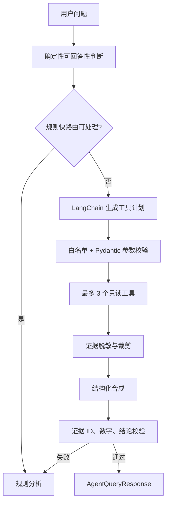

# 阶段 3：LangChain 受控编排与 Redis

> 周期：第 4–5 周  
> 目标：在不削弱现有 Guardrail 和规则降级的前提下引入 LangChain，并利用 Redis 提升重复查询性能、并发协调和长任务体验。

## 1. 为什么此阶段后置

LangChain 和 Redis 都是实现手段，不是业务事实来源。必须在 Agent 正确性、数据库事务、安全和日志边界稳定后接入，否则会同时放大调试面、数据一致性问题和隐私风险。

## 2. LangChain 架构

### 2.1 适配器接口

服务层依赖内部接口：

```python
class AgentModelAdapter(Protocol):
    def plan_tools(self, request: AgentPlanRequest) -> AgentPlan: ...
    def synthesize(self, request: SynthesisRequest) -> SynthesisResult: ...
```

提供两个实现：

- `DirectDeepSeekAdapter`：现有直接 HTTP Client，作为稳定回退。
- `LangChainDeepSeekAdapter`：使用 LangChain ChatModel、绑定工具和结构化输出。

通过 `AGENT_PROVIDER=direct|langchain` 切换；生产切换前两个实现必须运行同一契约测试。

### 2.2 受控执行流



### 2.3 工具规范

- 工具定义只有静态白名单：摘要、差评问题、好评主题、风险评论、版本、趋势、洞察读取等只读函数。
- 每个工具的参数 Schema 禁止额外字段，并限制字符串、列表和分页大小。
- 工具返回统一 envelope：`call_id`、`tool_name`、`status`、`data`、`limitations`、`duration_ms`。
- 工具不能接收数据库连接、Session、文件路径或任意表达式。
- LangChain callback 不能记录完整 prompt/response；只记录 token 数、耗时、模型名和错误类型。

### 2.4 暂不引入 LangGraph 的条件

MVP 的流程是有限步、最多三次工具调用且没有人工审批分支，LangChain Runnable 已足够。只有出现以下需求时再评估 LangGraph：

- 可恢复的多步骤工作流。
- 人工审批节点。
- 持久状态和跨请求继续执行。
- 多 Agent 协作。

不能仅为了“技术完整”引入图编排。

## 3. Redis 设计

### 3.1 Key 规范

所有 key 带版本前缀和环境：

```text
ara:{env}:v1:summary:{dataset_id}:{scope_hash}
ara:{env}:v1:insight:{dataset_id}:{scope_hash}
ara:{env}:v1:lock:summary:{dataset_id}:{scope_hash}
ara:{env}:v1:idempotency:{request_key}
ara:{env}:v1:job:{job_id}
```

规则：

- `scope_hash` 由规范化 filters、view、算法版本和 insight ID 计算。
- value 使用 JSON 或 msgpack，并包含 `schema_version`、`created_at`。
- 摘要默认 TTL 5 分钟，洞察元数据按数据集过期时间设置上限，锁 30–60 秒。
- 禁止使用 `KEYS`；失效使用 dataset 版本号、集合索引或 `SCAN` 的受限后台任务。

### 3.2 缓存一致性

读取流程：

1. 验证数据集存在且未过期。
2. 计算稳定 cache key。
3. 命中则反序列化并校验 schema version。
4. 未命中执行一次加载、一次过滤、一次摘要。
5. 写入缓存失败只记指标，不影响响应。

失效事件：

- 数据集删除或过期。
- 洞察创建/删除且摘要引用该 insight。
- 分析算法版本变化。
- 数据修复或重新预处理。

### 3.3 防击穿和幂等

- 同一 dataset/scope 的昂贵摘要可使用 `SET NX EX` 短锁。
- 未获得锁的请求短暂轮询已有缓存，超时后直接计算，不无限等待。
- 上传和洞察任务支持客户端幂等键；幂等记录只保存请求摘要和结果 ID，不保存评论正文。

### 3.4 异步任务

当实测任务经常超过 10 秒时引入 Celery：

- broker 使用 Redis；最终状态和结果 ID 写 PostgreSQL。
- 任务类型：大文件预处理、AI 洞察、批量 PII 脱敏或报告生成。
- 任务参数只传 ID，不把完整 DataFrame 放入 Redis 消息。
- 任务设置软/硬超时、有限重试、指数退避和不可重试错误列表。
- 删除数据集时取消尚未开始的任务；运行中的任务在提交结果前再次检查数据集存在性。

## 4. 配置

| 配置 | 默认 | 说明 |
| --- | --- | --- |
| `AGENT_PROVIDER` | `direct` | `direct` 或 `langchain` |
| `REDIS_URL` | 空 | 空时使用 NullCache |
| `CACHE_TTL_SECONDS` | `300` | 摘要 TTL |
| `CACHE_SCHEMA_VERSION` | `1` | 缓存结构版本 |
| `CELERY_ENABLED` | `false` | 长任务开关 |
| `JOB_SOFT_TIMEOUT_SECONDS` | `120` | 软超时 |
| `JOB_HARD_TIMEOUT_SECONDS` | `150` | 硬超时 |

生产环境启用 Redis 后，`/ready` 应报告 Redis 状态，但缓存用途下 Redis 故障只使服务进入 `degraded`。

## 5. 实施任务

| 编号 | 任务 | 验收 |
| --- | --- | --- |
| P3-001 | 提取 `AgentModelAdapter` | Agent Service 不依赖具体 LangChain 类 |
| P3-002 | 实现 LangChain Adapter | 与直接 Client 通过同一契约测试 |
| P3-003 | 绑定静态工具和结构化输出 | 非法工具/参数/输出均被服务端拦截 |
| P3-004 | 增加 provider 特性开关 | 无需改 API 即可回退 direct |
| P3-005 | 实现 Redis Cache Protocol | 未配置 Redis 时 NullCache 正常 |
| P3-006 | 完善 key、TTL 和失效 | 删除/过期后旧缓存不可读 |
| P3-007 | 增加防击穿短锁 | 并发相同摘要不产生大量重复计算 |
| P3-008 | 评估并接入 Celery | 仅超过阈值的任务异步化 |
| P3-009 | 增加缓存与任务指标 | 命中率、错误、耗时、队列长度可观测 |

## 6. 测试矩阵

### LangChain

- 工具选择、参数提取、最多三次调用。
- 非法工具、动态工具名、额外参数、恶意评论提示。
- 结构化输出非法 JSON、缺字段、未知 evidence ID。
- Direct 与 LangChain Adapter 对同一 fixture 的语义契约一致。
- DeepSeek 未配置、超时、限流和 5xx 时规则降级。

### Redis

- 命中、未命中、TTL、schema version 不匹配。
- 删除与过期后的精确失效。
- Redis 连接失败、读失败、写失败、超时。
- 20 个并发相同请求的防击穿行为。
- 不同 filters、view、insight ID 不发生串缓存。

### 任务

- 成功、可重试失败、不可重试失败、软/硬超时。
- Worker 重启后任务事实状态可恢复。
- 数据集删除后任务不写回孤儿结果。
- 任务消息不包含评论正文和令牌。

## 7. 退出条件

- `AGENT_PROVIDER=direct` 与 `langchain` 均通过 Agent 46/46。
- Redis 可用时摘要命中率可统计；Redis 停止后 API 自动回退计算且结果一致。
- 删除、过期和算法版本变化不会返回旧缓存。
- LangChain callback、Redis value 和 Celery message 均不包含令牌或未脱敏评论正文。
- 如启用 Celery，任务状态在 PostgreSQL 可恢复，失败可解释且重试有上限。

## 8. 风险与回退

- LangChain 版本升级破坏接口：锁定版本，保留 `DirectDeepSeekAdapter`，通过特性开关即时回退。
- Redis 延迟高于直接计算：设置短超时和熔断，NullCache 自动降级。
- 缓存串数据：cache key 必须包含数据集、规范化范围、算法版本；任何无法证明正确的缓存直接禁用。
- Celery 增加运维复杂度：没有持续超过 10 秒的任务就不启用 Worker，先保持同步。
