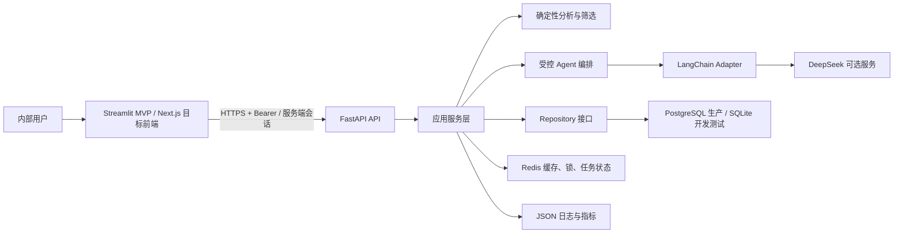

# App 评论舆情分析项目完整改进计划

> 文档版本：1.0  
> 基线日期：2026-08-05  
> 适用仓库：[app-review-analysis-agent](https://github.com/bluesblue320-hue/app-review-analysis-agent)  
> 实施周期：6 周可部署 MVP，8 周完成 LangChain、Redis 与新前端切换

## 1. 目标与发布策略

本计划不重写已有确定性分析算法，保留现有数据清洗、指标、筛选和规则降级能力。改造重点是把当前原型升级为可以在内部稳定运行、可追踪、可恢复、可扩展的产品。

采用两个发布门：

| 发布门 | 时间 | 交付结果 |
| --- | --- | --- |
| Gate A：可部署 MVP | 第 6 周末 | Agent 46/46、持久化、鉴权、脱敏、结构化日志、分页、模块化 Streamlit、容器部署、48 小时稳定性验证 |
| Gate B：增强版 | 第 8 周末 | LangChain 受控编排、Redis 缓存/锁/任务状态、Next.js 前端切换、端到端自动化验收 |

如果人力有限，Gate A 必须优先完成；Gate B 的任何功能都不能降低确定性分析、规则降级或数据安全能力。

## 2. 目标架构

架构边界：

- PostgreSQL 是生产数据的唯一事实来源；Redis 绝不保存唯一副本。
- LangChain 只承担模型适配、结构化输出和受控工具编排，不允许执行任意代码、任意 SQL 或动态注册工具。
- DeepSeek 未配置或调用失败时，看板、分页、确定性分析和规则 Agent 必须可用。
- Next.js 通过服务端代理或受保护会话访问 FastAPI，不把共享访问令牌写入浏览器持久存储。

## 3. 阶段与文档索引

| 阶段 | 周期 | 核心结果 | 详细文档 |
| --- | --- | --- | --- |
| 阶段 0 | 2–3 天 | 冻结基线、修复当前集成阻塞、确认架构决策 | [阶段 0：基线与架构决策](00-phase-0-baseline-and-decisions.md) |
| 阶段 1 | 第 1–2 周 | Agent 正确性、安全回答、CI 与覆盖率基线 | [阶段 1：正确性与质量](01-phase-1-agent-quality.md) |
| 阶段 2 | 第 2–4 周 | 数据持久化、鉴权、脱敏、日志和容器部署 | [阶段 2：持久化、安全与部署](02-phase-2-data-security-deployment.md) |
| 阶段 3 | 第 4–5 周 | LangChain 受控接入、Redis 缓存与任务协调 | [阶段 3：LangChain 与 Redis](03-phase-3-langchain-redis.md) |
| 阶段 4 | 第 5–7 周 | Streamlit 模块化、Next.js 渐进式前端改造 | [阶段 4：前端与体验](04-phase-4-frontend.md) |
| 阶段 5 | 第 6–8 周 | 性能优化、稳定性验证、上线与回滚 | [阶段 5：性能与发布](05-phase-5-performance-release.md) |

跨阶段约束：

- [API、数据模型与配置契约](06-api-data-config-contract.md)
- [测试、CI 与验收矩阵](07-test-ci-acceptance.md)
- [部署与运维手册](08-operations-runbook.md)
- [可执行任务清单](09-delivery-backlog.md)

## 4. 当前基线状态

当前工作树包含大量未提交改动，必须作为实现基线保留。经仓库检查，可归纳为：

- 已部分完成：Agent 可回答性防护、`limitations`、结构化模型输出、数字来源校验、数据集删除、评论分页接口、SQLAlchemy/Redis/鉴权/生命周期基础文件。
- 已独立验证：Mock Agent 评估曾达到 46/46。
- 尚未完成：依赖声明、Alembic、主应用中间件与生命周期接线、`/ready`、PII 脱敏、Compose、CI、前端改造和全量回归。
- 当前存在集成阻塞：部分 Schema 和 SQLAlchemy Insight Store 代码需要先修复并重新运行完整测试，不能把“文件已存在”视为“功能已完成”。
- 仓库根目录存在临时 `.patch` 文件，阶段 0 核对其内容已落盘后应删除，避免进入提交。

## 5. 项目级成功指标

| 维度 | 必须达到的指标 |
| --- | --- |
| 正确性 | 原有测试全部通过；Agent Mock 固定评估 46/46；不可回答、回答约束、提示注入用例 100% |
| 代码质量 | Ruff 通过；pytest 覆盖率不低于 80%；迁移检查和 Compose 健康检查通过 |
| 安全 | 除 `/health`、`/ready` 外全部鉴权；生产缺少令牌拒绝启动；令牌、评论正文和完整提示不进入日志 |
| 数据 | 生产重启后数据可恢复；删除级联；默认 30 天过期；过期清理可观测且可重复执行 |
| 上传 | 最大 10 MB、10,000 行、50 列、单评论 5,000 字；支持 UTF-8、UTF-8 BOM、GB18030 |
| 性能 | 10,000 行上传和预处理不超过 30 秒；预热摘要 P95 不超过 3 秒；分页接口 P95 不超过 1 秒 |
| 可用性 | DeepSeek 未配置/超时/错误响应时确定性功能可用；Redis 故障时缓存降级；48 小时稳定性验证通过 |
| 前端 | 登录、上传、筛选提交、分页、到期提示、主动删除、AI 降级均有端到端测试 |

## 6. 实施原则

1. 每个阶段开始前，上一阶段的退出条件必须通过。
2. 数据库迁移、API 契约和安全策略先于 UI 依赖它们的功能。
3. 新旧实现采用适配器和特性开关并行，验证后再切换默认路径。
4. 任何缓存都必须可删除、可过期、可绕过，缓存失败不能造成数据错误。
5. 所有模型结论必须来自成功工具证据；不支持的预测或因果问题必须明确说明限制。
6. 每次合并只包含一个可验证目标，并附带测试或迁移验证结果。

## 7. 建议团队分工

| 角色 | 主要职责 |
| --- | --- |
| 后端负责人 | Repository、数据库、API、安全、中间件、任务系统 |
| AI/Agent 负责人 | 可回答性、LangChain Adapter、工具契约、评估集、模型降级 |
| 前端负责人 | Streamlit 模块化、Next.js、会话、分页和可视化 |
| QA/运维负责人 | CI、性能测试、Compose、稳定性验证、备份恢复和发布记录 |

小团队可一人兼任多个角色，但数据库迁移、安全接线和删除逻辑至少需要一次独立复核。
